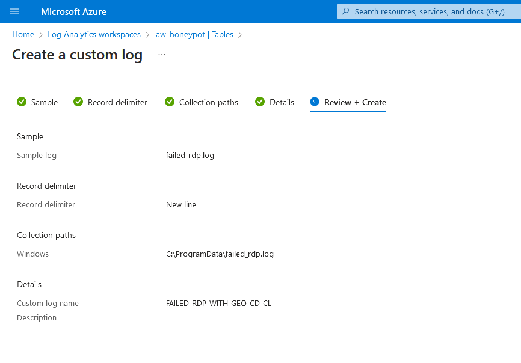

# Azure Sentinel Honeypot | Attack Map

Credit goes to Josh Madakor for this lab! You can find his video [here](https://www.youtube.com/watch?v=RoZeVbbZ0o0&list=PL_MvTIq1Tl-X04__sDhuQ89qo-g72DaBt&index=3).

### Learning Objectives:

- Configuration & Deployment of Microsoft Azure virtual machines, Log Analytics Workspaces, and Microsoft Sentinel
- Hands-on experience with a SIEM (Security Information and Event Management)
- Understanding Windows Security Event logs
- Using KQL to query logs
- Display attack data on a dashboard with Workbooks (Failed RDP World Map)

### Tools & Requirements:

1. Microsoft Azure
2. Remote Desktop Protocol (RDP)
3. 3rd Party API: ipgeolocation.io
4. Custom [Powershell Script](https://github.com/joshmadakor1/Sentinel-Lab/blob/main/Custom_Security_Log_Exporter.ps1) by Josh Madakor


## Step 01: Create a Microsoft Azure Subscription
1. Navigate to [Microsoft Azure](azure.microsoft.com) and create a free acount
2. Your free account will give you $200 credit for the lab!
## Step 02: Deploying a Honeypot
1. Create a Virtual Machine (VM)

2. Set a user name and password. Remember these as you will need them to log
   into the Virtual Machine

3. Leave Disk as all defaults
4. In the networking section create a new inbound security rule to allow all
   inbound traffic,
 
5. Create your VM

## Step 03: Log Analytics Workspace


## Step 04: Microsoft Defender for Cloud
1. Search for "Microsoft Defender for Cloud"
2. Select "Environment Settings" and under Name select the Log Analytics
   Workspace that you named.

3. Set both Cloud Security Posture Management and Servers to ON. Leave SQL
   servers on machines OFF

4. Don't forget to click "Save"

## Step 05: Connect the Log Analytics Workspace to the Virtual Machine
WARNING: The Log Analytics agent is on a deprecation path and won't be supported
after August 31, 2024. If you use the Log Analytics agent to ingest data to
Azure Monitor, migrate to the new Azure Monitor agent prior to that date.

1. Navigate to Log Analytics Workspace
2. Select your virtual machine to connect it to the Log Analytics

## Step 06: Microsoft Sentinel
1. Navigate to Microsoft Sentinel
2. Create Microsoft Sentinel
3. Select your Log Analytics Workspace name
4. Click add!

## Step 07: Disabling the Firewall in the Windows VM
1. Log into your Windows VM via RDP
2. Once logged in type ``wf.msc`` in Start
3. Click on Windows Defender Firewall Properties and turn the firewall off for
   Domain, Private and Public Profiles.

4. Try pinging you Virtual Machine from your host. This should work.

## Step 08: Scripting the Security Log Exporter
1. In the Windows VM download the [Powershell script](https://github.com/joshmadakor1/Sentinel-Lab/blob/main/Custom_Security_Log_Exporter.ps1)
2. Open the script in Powershell ISE

3. Save the script. I saved it as "log-exporter"
4. Navigate to https://ipgeolocation.io/ and sign up. You need to get the
   provided api key and paste it into the script.


5. Run the script and navigate to ``C:\ProgramData\failed_rdp``
6. Copy the contents of ``failed_rdp``

# Step 09: Using a custom log in Log Analytics Workspace
1. This will allow us to ingest the data that we are getting from the previous script
2. Navigate to the Log Analytics Workspace
3. Create a custom log by clicking on Tables and New custom log (MMA-based)

4. Give a name to your custom log
5. Click "Next" for Record delimiter
6. Choose Windows for Collection paths and give it the path to the
``failed_rdp.log`` in the Windows VM which would be
``C:\ProgramData\failed_rdp.log``
7. Name your custom log such as ``FAILED_RDP_WITH_GEO``
8. Click Create


# Step 10: Query Your Custom Log with KQL
It may take some time for Azure to sync the VM and Log Analytics so be
   patient if you don't get results immediately. 

  
1. Use the following KQL command to see some Failed RDP attempts! ``FAILED_RDP_WITH_GEO_CL``
 
# Step 12: Mapping the Data in Microsoft Sentinel

1. Navigate to Microsoft Sentinel > Workbooks > Add workbook
2. Edit the workbook and remove the default widgets
3. Add a new query and paste the KQL query below:
 
```
FAILED_RDP_WITH_GEO_CL | extend username = extract(@"username:([^,]+)", 1, RawData),
         timestamp = extract(@"timestamp:([^,]+)", 1, RawData),
         latitude = extract(@"latitude:([^,]+)", 1, RawData),
         longitude = extract(@"longitude:([^,]+)", 1, RawData),
         sourcehost = extract(@"sourcehost:([^,]+)", 1, RawData),
         state = extract(@"state:([^,]+)", 1, RawData),
         label = extract(@"label:([^,]+)", 1, RawData),
         destination = extract(@"destinationhost:([^,]+)", 1, RawData),
         country = extract(@"country:([^,]+)", 1, RawData)
| where destination != "samplehost"
| where sourcehost != ""
| summarize event_count=count() by latitude, longitude, sourcehost, label, destination, country 
```
4. Run the Query!
5. You can continue refreshing the map to display more failed RDP attacks. Here
   the honey pot has only been running for a couple of hours and I already have
   over 1,12k hits from the Philippines!


## Wrapping up

I hope you have enjoyed going through the lab, as much as I did! Don't forget to
deprovision your Azure services when you have decided to stop gathering failed
RDP attacks so you don't get charged!


